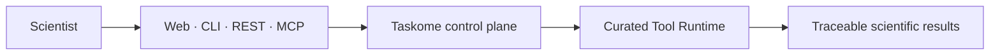

<div align="center">

# Taskome

**Run protein-design compute through one consistent, reproducible platform.**

[](#project-status)
[](https://www.typescriptlang.org/)
[](https://go.dev/)
[](https://www.python.org/)
[](LICENSE)

[Product vision](docs/product/vision.md) ·
[Architecture](docs/architecture/overview.md) ·
[Contributing](CONTRIBUTING.md)

</div>

Taskome is XDenovo's platform for running, managing, and reproducing
protein-design compute. It gives scientists a curated interface for submitting
work, tracking execution history, and working with scientific files from the
web, an AI agent, the CLI, or a direct API client.

Instead of rebuilding environments and integrations for every scientific
program, Taskome packages each supported capability as a versioned Tool with
explicit inputs, parameters, outputs, and provenance.

## Project status

> [!IMPORTANT]
> Taskome is under active development and is not ready for production use.

The [product vision](docs/product/vision.md) defines the launch boundary. The
[architecture overview](docs/architecture/overview.md) distinguishes the
accepted target design from the current implementation.

## Start local development

Install [mise](https://mise.jdx.dev/) and Docker, then run from the repository
root:

```bash
mise run setup
mise run doctor
mise run dev
```

When the development environment is ready:

- the authenticated console runs at
  [http://localhost:3001](http://localhost:3001);
- the API runs at [http://localhost:3000](http://localhost:3000);
- the API health check responds at
  [http://localhost:3000/healthz](http://localhost:3000/healthz); and
- Scalar renders the API reference at
  [http://localhost:3000/reference](http://localhost:3000/reference).

The setup task installs the pinned Node.js, pnpm, Go, Python, uv, and Pixi
toolchain, installs dependencies, creates missing local environment files, and
configures Git hooks. See the [contribution guide](CONTRIBUTING.md) for the full
development workflow.

## Understand the platform



Taskome keeps one product model across every access channel:

- **Tools** define curated scientific capabilities and their contracts.
- **Jobs** record immutable requests with fixed inputs and parameters.
- **Attempts** record each actual execution of a Job.
- **Projects** organize related Jobs and scientific files.
- **Utilities** inspect or prepare scientific data without creating a Job.

Read [`CONTEXT.md`](CONTEXT.md) for the canonical domain vocabulary and the
[architecture documentation](docs/architecture/overview.md) for system
boundaries, data ownership, execution, and deployment.

## Explore the monorepo

| Area                                     | Responsibility                                                |
| ---------------------------------------- | ------------------------------------------------------------- |
| [`apps/console`](apps/console/README.md) | Authenticated Taskome product application                     |
| [`apps/server`](apps/server/README.md)   | Authentication, REST API, and application data                |
| [`apps/cli`](apps/cli/README.md)         | Go command-line client                                        |
| [`apps/web`](apps/web/README.md)         | Public XDenovo marketing site                                 |
| [`apps/docs`](apps/docs/README.md)       | Public Taskome documentation site                             |
| `apps/execution`                         | Reserved scaffold for the future Execution Service            |
| `packages`                               | Shared libraries and configuration                            |
| [`runtimes`](runtimes/fpocket/README.md) | Immutable environments for scientific Upstream Software       |
| [`docs`](docs/README.md)                 | Internal product, architecture, and engineering documentation |
| `references`                             | Read-only, pinned upstream research checkouts                 |

The main implementation stack includes React, TanStack Router, Next.js,
Tailwind CSS, Hono, Zod OpenAPI, Better Auth, PostgreSQL, Drizzle ORM, Go with
Cobra, and Python Tool Runtimes. Mise coordinates the polyglot toolchain and
repository tasks; pnpm and uv manage the JavaScript and Python workspaces.

## Run common tasks

| Command                     | Purpose                                                 |
| --------------------------- | ------------------------------------------------------- |
| `mise run dev`              | Start support services, the server, and the console     |
| `mise run check`            | Run read-only formatting, lint, type, and schema checks |
| `mise run test`             | Run service-free test suites                            |
| `mise run test:integration` | Run container-backed integration tests                  |
| `mise run build`            | Build all deliverable applications                      |
| `mise run verify`           | Run the complete pre-push verification gate             |
| `mise tasks`                | Discover repository and workspace-specific tasks        |

## Read the documentation

- [Project documentation](docs/README.md) routes to product, architecture, and
  engineering material.
- [Product vision](docs/product/vision.md) explains the problem, audience, and
  launch scope.
- [Architecture overview](docs/architecture/overview.md) describes the target
  system and its current implementation gap.
- [Domain context](CONTEXT.md) defines the terms used across product, code, and
  documentation.
- [Contributing](CONTRIBUTING.md) covers setup, development, verification, and
  pull requests.
- [Code of Conduct](CODE_OF_CONDUCT.md) defines the community standards.

## Contributing

Contributions should be focused, tested, and documented. Start with
[`CONTRIBUTING.md`](CONTRIBUTING.md), follow the project-wide
[coding standards](docs/engineering/coding-standards.md), and use Conventional
Commits for commit messages.

## License

Taskome is available under the [MIT License](LICENSE).
