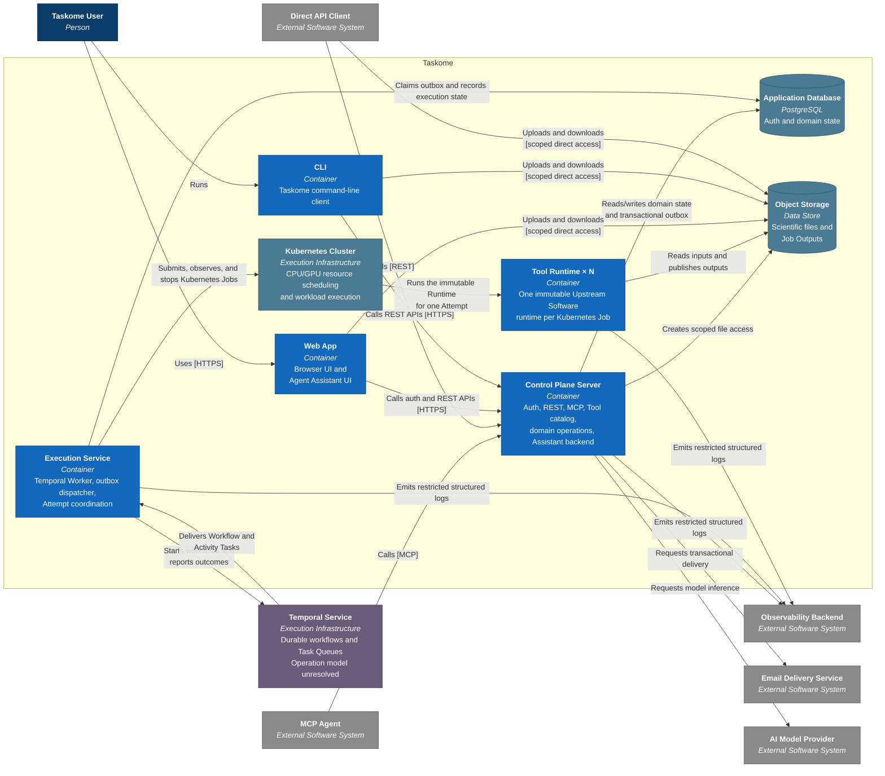

# Containers

This page defines Taskome's accepted target Container architecture for launch.
It expands the Taskome system from [`context.md`](./context.md) into separately
runnable applications, data stores, and execution infrastructure. Several of
these containers are not implemented yet; repository code and application
READMEs remain the authority for current behavior.

The diagram names technologies only where the choice is accepted. Deployment
products and topology remain outside this page unless they change an
application responsibility or trust boundary.

## Container diagram

The Temporal Service sits outside the Taskome box only to keep its operational
boundary visibly unresolved. A managed Temporal Service would be an external
runtime dependency. A self-hosted Temporal Service would be Taskome-operated
infrastructure and move inside the deployment boundary without changing the
application responsibilities shown here.

Production ingress is intentionally absent. A reverse proxy or managed edge
may terminate TLS, serve the Web App, and route REST, MCP, and authentication
traffic, but it must not own identity or business policy.

## Container responsibilities

| Container                | Responsibility                                                                                                                                    | Data ownership                                                                                                                                                                                        |
| ------------------------ | ------------------------------------------------------------------------------------------------------------------------------------------------- | ----------------------------------------------------------------------------------------------------------------------------------------------------------------------------------------------------- |
| **Web App**              | Provides the authenticated browser experience, integrated Utilities, and the Agent Assistant UI. It calls the Control Plane Server without a BFF. | Browser state only. It does not own authentication or domain records.                                                                                                                                 |
| **CLI**                  | Provides Taskome's interactive and programmatic command-line journeys.                                                                            | Local authorization material and user-selected local files only.                                                                                                                                      |
| **Control Plane Server** | Owns authentication, authorization, REST, MCP, the Tool catalog, domain operations, file-access grants, and the Agent Assistant backend.          | Owns authentication and Taskome domain records in the Application Database.                                                                                                                           |
| **Execution Service**    | Dispatches the transactional outbox, runs Taskome's Temporal Worker, coordinates Attempts, and submits, observes, or stops Kubernetes Jobs.       | Writes Attempt transitions, usage, and output finalization directly to the Application Database through a narrow, least-privilege domain-transition role. It does not own a separate domain database. |
| **Application Database** | Persists authentication, authorization, Projects, Tool metadata, Batches, Jobs, Attempts, file metadata, provenance, and usage.                   | PostgreSQL is the authoritative source for user-visible Taskome state. It does not contain scientific file bytes.                                                                                     |
| **Object Storage**       | Durably stores saved scientific files, immutable Job inputs, and published Job Outputs.                                                           | Owns scientific file bytes. The provider and storage product remain unresolved.                                                                                                                       |
| **Temporal Service**     | Persists workflow history, maintains Temporal Task Queues, timers, and workflow recovery.                                                         | Owns Temporal's internal workflow state. It never becomes the authoritative Taskome domain store.                                                                                                     |
| **Kubernetes Cluster**   | Schedules every launch Attempt against declared CPU, GPU, and custom resources as a Kubernetes Job, then runs its workload.                       | Owns transient scheduling and execution state (Job and Pod objects). It is not durable Taskome file storage.                                                                                          |
| **Tool Runtime**         | Runs one immutable version of an Upstream Software for an Attempt. One Runtime may expose one or more Tools from that Software.                   | Reads and publishes scientific files through Object Storage. It cannot access the Application Database or user authorization records.                                                                 |

The Agent Assistant is a feature across two containers rather than its own
container. The Web App owns its interface; the Control Plane Server enforces
authorization, exposes Taskome operations, and communicates with the external
AI Model Provider.

## Keep domain and execution state separate

Taskome, Temporal, and Kubernetes describe different layers of the same execution:

| Layer                       | Stable identity and role                                                                                                                                                         |
| --------------------------- | -------------------------------------------------------------------------------------------------------------------------------------------------------------------------------- |
| **Taskome Job and Attempt** | Product-visible, durable domain records. A retry that runs scientific compute again creates a new Attempt under the same Job.                                                    |
| **Temporal Workflow**       | One internal Workflow Execution per Attempt. Its Workflow ID is derived from the Attempt ID. Temporal makes coordination durable but does not replace the Job or Attempt record. |
| **Kubernetes Job**          | One resource-scheduled compute workload per Attempt. Its Job name is derived from the Attempt ID. Every launch Tool, including CPU-only Tools, follows this execution path.      |
| **Tool Runtime invocation** | The one scientific execution represented by that Attempt. Infrastructure recovery must not silently invoke it again under the same Attempt.                                      |

Kubernetes enforces the declared CPU, memory, and GPU resource limits at the
container-runtime level, controlling placement and concurrency. This is not by
itself a complete untrusted-workload security boundary. Runtime and deployment
design must still enforce any additional physical containment that a Tool
requires.

Temporal may retry idempotent coordination, such as observing a known
Kubernetes Job or recording progress. A retried coordination operation must
reconnect using the Attempt-derived identities rather than launch another
workload. Kubernetes's own Job retry behavior (`backoffLimit`) must not cause a
Tool Runtime to execute twice for one Attempt — Taskome's own retry policy, not
Kubernetes's, decides whether a Tool Runtime runs again, and only under a new
Attempt. Exact failure classes, retry limits, cancellation races, and timeouts
belong in [`runtime.md`](./runtime.md).

## Hand accepted work to Temporal durably

Creating an Attempt and starting its Temporal Workflow crosses PostgreSQL and
Temporal. The Control Plane Server therefore writes the Attempt and a
transactional-outbox record in one PostgreSQL transaction. The Execution
Service repeatedly dispatches unprocessed records and starts each Workflow
with its Attempt-derived ID. Duplicate dispatch is safe; a committed Attempt
cannot disappear because the Server stopped before contacting Temporal.

This outbox is a reliability seam, not another compute scheduler. Temporal owns
durable workflow coordination after dispatch, and Kubernetes owns
resource-aware compute scheduling.

## Keep scientific files out of control traffic

The Control Plane Server stores file metadata and authorizes short-lived,
scoped access. The Web App, CLI, and Direct API Client transfer supported file
bytes directly to or from Object Storage. MCP returns safe inline content or a
download reference instead of routing large bytes through an agent context.

Tool Runtimes use immutable input references and publish successful Job Outputs
to Object Storage. They return only execution metadata and output references to
the Execution Service. Temporal payloads likewise contain identifiers,
parameters, and file references rather than scientific file contents.

A Tool Runtime's ephemeral container workspace may hold temporary values during
one compute workload. Those values do not become saved files or Job Outputs
until the Tool Runtime publishes them to Taskome's Object Storage.

If Taskome self-hosts Temporal, Temporal's persistence and visibility data must
use credentials and a database or schema isolated from the Application
Database. Taskome code must never read or write Temporal's internal tables.

## Publish Tools independently of Runtime availability

The Control Plane Server owns the user-visible Tool catalog. It does not query
live Tool Runtimes to construct Tool documentation or contracts. A Tool remains
discoverable when its Runtime is unavailable, although new Attempts may have to
wait or fail explicitly.

Publishing a Tool supplies an approved manifest and an immutable Runtime
artifact. The manifest binds:

- the Tool and Upstream Software versions;
- the curated input, parameter, and output contract;
- declared CPU, GPU, and custom resources; and
- an immutable identifier for the Runtime artifact.

An Attempt records the exact versions and Runtime artifact it uses. The
Runtime artifact is an OCI image stored in GitHub Container Registry. A
human-readable tag combines the upstream version with a Runtime revision, but
the Attempt binds the immutable OCI digest. Exact build, signing, scanning,
retention, and promotion mechanisms remain unresolved; see
[`components/tool-runtime.md`](./components/tool-runtime.md).

## Map target containers to the repository

| Target container     | Current repository mapping                                                                      |
| -------------------- | ----------------------------------------------------------------------------------------------- |
| Web App              | `apps/console`                                                                                  |
| CLI                  | `apps/cli`                                                                                      |
| Control Plane Server | `apps/server`                                                                                   |
| Application Database | PostgreSQL is the only supporting service in `compose.yml`.                                     |
| Execution Service    | Not present in the current repository; its source layout remains unresolved.                    |
| Temporal Service     | Not present in the current repository.                                                          |
| Kubernetes Cluster   | Not present in the current repository.                                                          |
| Object Storage       | Not present in the current repository.                                                          |
| Tool Runtimes        | `runtimes/fpocket` contains a locked image skeleton; its Attempt entrypoint is not implemented. |

Shared packages such as `@taskome/config`, `@taskome/env`, and `@taskome/ui`
are not containers because they are not deployed or executed independently.
The `packages/toolkit` scaffold similarly targets the shared
`runtime_toolkit` Python library that future Runtime images embed; it is not an
independently deployed container or a dependency of the current fpocket
skeleton.

The following repository applications also stay outside the Taskome Container
diagram:

| Repository application | System responsibility                                                                                                                          |
| ---------------------- | ---------------------------------------------------------------------------------------------------------------------------------------------- |
| `apps/web`             | XDenovo Marketing Site. It links visitors to Taskome registration and sign-in but has no Taskome runtime or data dependency.                   |
| `apps/docs`            | Public Taskome Documentation Site. Taskome links to it, but it does not participate in authentication, compute, or scientific-data lifecycles. |

## Keep deployment choices explicit

The following choices do not change the accepted Container responsibilities
and remain unresolved:

- Temporal Cloud or a self-hosted Temporal Service;
- the Object Storage product and provider;
- the Kubernetes distribution and node-management platform (for example a
  lightweight distribution such as k3s or k0s, self-managed nodes, or a
  managed Kubernetes offering);
- Tool Runtime signing, scanning, retention, and promotion policy;
- Web App hosting and the production public edge, including whether Taskome
  uses Caddy, Nginx, Traefik, or a managed edge service; and
- concrete scaling, availability, timeout, and retry settings.

## Related docs

- [`context.md`](./context.md) — the system boundary and external systems this
  page expands.
- [`vision.md`](../product/vision.md) — product scope and access channels.
- [`requirements.md`](../product/requirements.md) — checkable behavior for
  Tools, Jobs, Attempts, files, scheduling, and usage.
- [`CONTEXT.md`](../../CONTEXT.md) — canonical product and domain vocabulary.
- [`runtime.md`](./runtime.md) — Job and Attempt submission, execution,
  cancellation, failure recovery, retry, and result publication.
- [`deployment.md`](./deployment.md) — environment shapes, container-to-machine
  mapping, and open deployment choices.
- [`components/tool-runtime.md`](./components/tool-runtime.md) — Runtime
  repository layout, dependency planes, source tracking, and image contract.
- [`docs/README.md`](../README.md) — documentation status and source-of-truth
  rules during the architecture rewrite.
