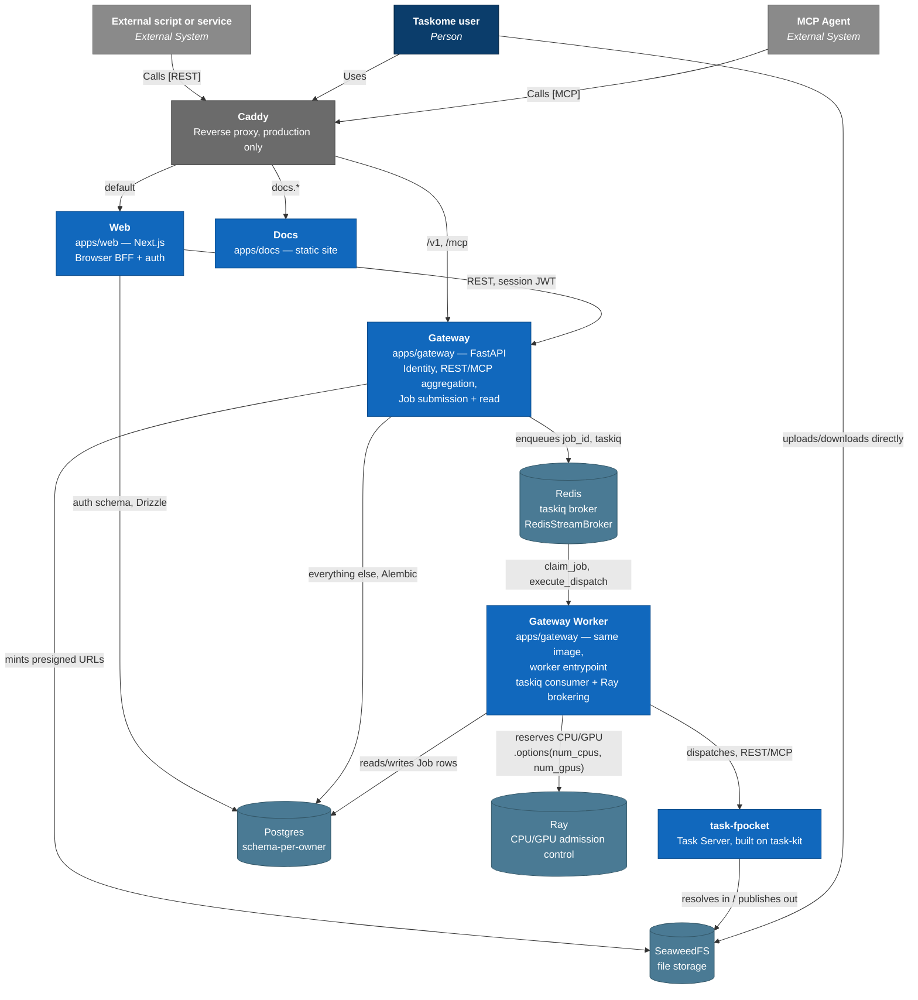

# Containers

This is the C4 Model's **Container** level: what's inside the "Taskome" box from [`context.md`](./context.md), and how those pieces talk to each other. It shows the _Now_ architecture — [`docs/product/vision.md`](../product/vision.md)'s design intent for v1 — not necessarily what today's code fully implements yet. Where the two diverge, a status note says so explicitly; delete that note once the gap closes, don't treat it as permanent commentary.

## Diagram

Drawn as a plain Mermaid flowchart styled with C4 colors, for the same reason as `context.md`: Mermaid's native `C4Container` type overlaps relationship labels once a diagram has this many elements.

`context.md`'s other external systems — the XDenovo public website and Axiom — aren't repeated here; this diagram's job is Taskome's internal shape, not a full re-statement of the system boundary.

## What each container is

| Container      | What it is                                                                                                                                                                                                                                                                                     | Owns                                                 |
| -------------- | ---------------------------------------------------------------------------------------------------------------------------------------------------------------------------------------------------------------------------------------------------------------------------------------------- | ---------------------------------------------------- |
| Caddy          | Reverse proxy, the single public edge. Production only — dev exposes each service's own port directly.                                                                                                                                                                                         | Routing only, no data                                |
| Web            | `apps/web` (Next.js) — the browser's BFF, plus Better Auth's authentication surface                                                                                                                                                                                                            | Auth data (Drizzle-managed schema)                   |
| Gateway        | `apps/gateway` (FastAPI) — the identity boundary, REST/MCP aggregation, Job submission and reads                                                                                                                                                                                               | Everything else (Alembic-managed schema)             |
| Gateway Worker | `apps/gateway`, same codebase and image as Gateway — a separate entrypoint that consumes the taskiq queue, brokers Ray resources, and dispatches to Task Servers. One deployable with Gateway per [ADR-0004](../adr/0004-gateway-owned-job-dispatch.md), two processes. Single replica for v1. | Nothing of its own — writes through Gateway's schema |
| Docs           | `apps/docs` — Taskome's own static documentation site; no Gateway access                                                                                                                                                                                                                       | Nothing (static content only)                        |
| task-fpocket   | A Task Server, built on `packages/task-kit`                                                                                                                                                                                                                                                    | Nothing directly — reads/writes files via SeaweedFS  |
| Postgres       | One shared instance, split by schema per owner                                                                                                                                                                                                                                                 | —                                                    |
| Redis          | taskiq's broker (`RedisStreamBroker`), for durable Job intake                                                                                                                                                                                                                                  | —                                                    |
| Ray            | CPU/GPU admission control for compute Jobs — reserves capacity per dispatch, doesn't manage Task Server processes                                                                                                                                                                              | —                                                    |
| SeaweedFS      | S3-compatible object storage for Input Files and Job outputs                                                                                                                                                                                                                                   | —                                                    |

## Job execution: from request to compute

Gateway's API process is where a Job gets submitted and read back — a REST `POST /v1/jobs` or an MCP `submit_<task>` call creates a `queued` Job row and enqueues its `job_id`, durably, through taskiq backed by Redis, before anything runs. Every access channel shares the same lifecycle: submit, get a Job ID back immediately, then poll (`GET /v1/jobs/{id}`, or MCP's `get_job`/`wait_job`) rather than hold a connection open.

The **Gateway Worker** — a separate process built from the same codebase as Gateway's API (see the container table above) — is what actually moves a Job forward. It consumes the queue as a **two-phase taskiq task chain**: a `claim_job` task does a row-locked `queued → running` transition and hands off to an `execute_dispatch` task, which asks Ray for CPU/GPU capacity (admission control only — Ray doesn't manage Task Server processes, it just makes the cluster's physical capacity a real constraint across every Task Server at once), then makes a direct, blocking REST or MCP call to the Task Server — the same dual interface every Task exposes outward (see [`overview.md`](./overview.md)'s Core principles). That call's response is the completion signal; the worker writes the terminal Job state straight to Postgres.

A stuck Job is detected two ways, deliberately not by a single fixed timeout: a heartbeat (is the worker process that owns this Job still alive, checked independent of how long the Task itself should take) and a per-Task worst-case execution ceiling declared on that Task's manifest (is the Task Server itself hung). See [ADR-0008](../adr/0008-taskiq-ray-async-job-dispatch.md) for the full reasoning behind this split, why message acknowledgment happens early rather than after completion, and why only a narrow class of dispatch failures gets retried automatically.

Gateway's API and Worker processes are one deployable, two processes — a deliberate v1 simplification, not an oversight: `vision.md`'s Future direction already anticipates splitting queue consumption and Ray brokering into an independent scheduler once single-machine scheduling stops being enough (deeper allocation strategies, queue fairness, multi-machine deployment). Now isn't that point yet.

## File storage

Large Input Files and Job outputs never pass through Gateway's own request path. SeaweedFS issues presigned URLs that a client uploads or downloads against directly, and `task-fpocket` (through `task-kit`'s `TaskServerRuntime` port) resolves inputs and publishes outputs the same way. Gateway only mints the URLs — it never proxies the bytes.

> **Status note (delete once built):** This direct-access design is implemented in Gateway's code today (a public/internal client split, specifically so presigned URLs work from outside the deployment's internal network), but production wiring isn't complete — `compose.prod.yml` doesn't yet include SeaweedFS, and Caddy doesn't route to it. Today this only works in local development.

## Data ownership

Web and Gateway share one Postgres instance but never share tables. Web's schema is Drizzle-managed and holds only auth data; Gateway's schema is Alembic-managed and holds everything else. Neither queries the other's tables directly — the one sanctioned path between them is Web's BFF calling Gateway's REST API with a session JWT, shown in the diagram above.

## Shared libraries

The containers above are built from shared packages, which aren't separately deployed and so don't appear as their own boxes: every Task Server — `task-fpocket` today, more as the catalog grows — is built on `packages/task-kit`'s `build_task_server`; `@taskome/config` and `@taskome/ui` are shared between Web and Docs. See [`docs/engineering/coding-standards.md`](../engineering/coding-standards.md) for the module-boundary rules governing what belongs in a shared package versus an app.

## Related docs

- [`context.md`](./context.md) — the system boundary this diagram zooms into.
- [`overview.md`](./overview.md) — why Taskome is built this way.
- [`data.md`](./data.md) — the data model behind Postgres's schema split.
- [`integrations.md`](./integrations.md) — SeaweedFS and Ray in more detail.
- [`security.md`](./security.md) — how identity flows through Web, Gateway, and the Task Servers.
- [`deployment.md`](./deployment.md) — how these containers actually run in production.
- [`docs/adr/`](../adr/) — the decisions behind this shape.
