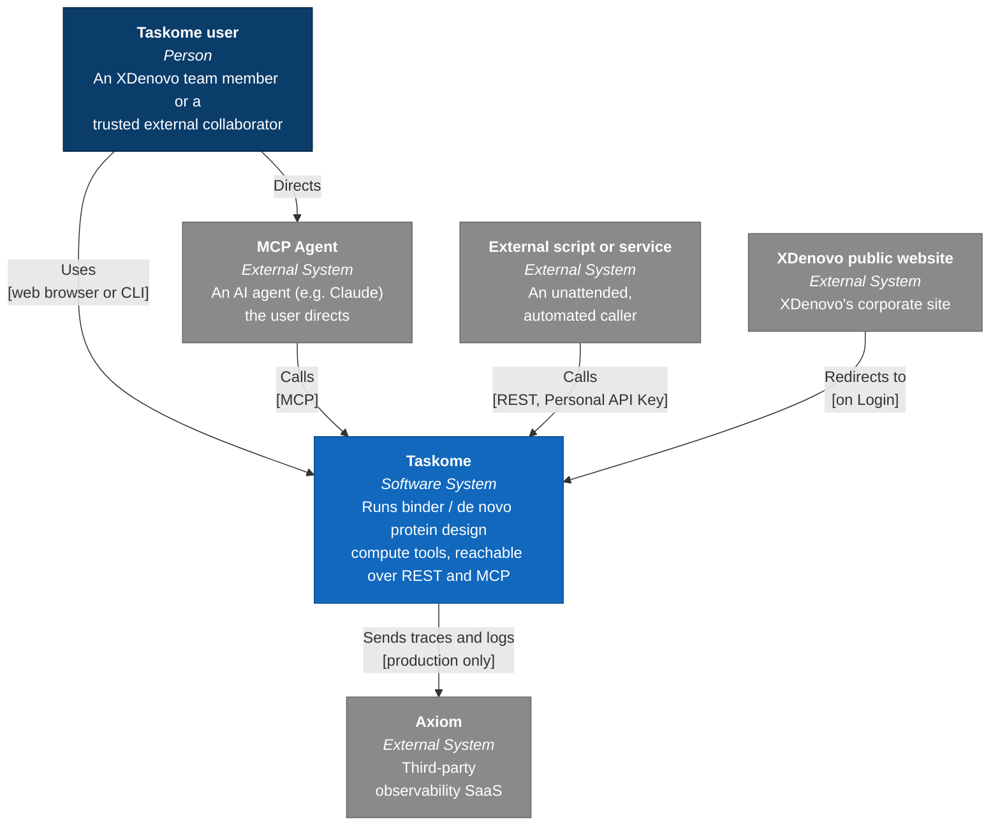

# System context

This is the C4 Model's **Context** level: Taskome drawn as a single box, and everything outside it that talks to it. It doesn't show what's inside that box — see [`containers.md`](./containers.md) for that — and it doesn't explain why the system is shaped this way — see [`overview.md`](./overview.md) for that. This page only answers one question: who or what crosses Taskome's boundary, and how.

## Diagram

This is drawn as a plain Mermaid flowchart rather than `C4Context`: Mermaid's native C4 diagram type has a weak auto-layout engine that overlaps relationship labels once a handful of external systems are involved. The color coding below follows C4 convention (dark blue = person, blue = the system itself, gray = external system) without relying on that diagram type.

## What each element is

| Element                    | What it is                                                                                    | Relationship to Taskome                             |
| -------------------------- | --------------------------------------------------------------------------------------------- | --------------------------------------------------- |
| Taskome user               | An XDenovo team member or a trusted external collaborator                                     | Uses Taskome through a web browser or the CLI       |
| MCP Agent                  | An AI agent (for example, Claude) the user directs                                            | Calls Taskome over MCP on the user's behalf         |
| External script or service | An unattended, automated caller authenticated with a Personal API Key                         | Calls Taskome's REST API directly                   |
| XDenovo public website     | XDenovo's corporate site — a separate product that happens to share the `apps/web` deployment | Its Login button redirects the user into Taskome    |
| Axiom                      | Third-party observability SaaS                                                                | Receives Taskome's traces and logs, production only |

Postgres, Redis, SeaweedFS, and Ray aren't shown here because they're not _external_ — Taskome deploys and operates all four itself, so at the Context level they're invisible, folded into the single "Taskome" box above; they reappear as containers in [`containers.md`](./containers.md).

## Related docs

- [`overview.md`](./overview.md) — why Taskome is built this way.
- [`containers.md`](./containers.md) — what's inside the Taskome box.
- [`docs/product/vision.md`](../product/vision.md) — who Taskome is for and what the access channels are for.
- [`docs/engineering/observability.md`](../engineering/observability.md) — what Taskome sends to Axiom and why.
- [`docs/adr/0002-identity-and-access-channels.md`](../adr/0002-identity-and-access-channels.md) — the access-channel decision behind this diagram.
