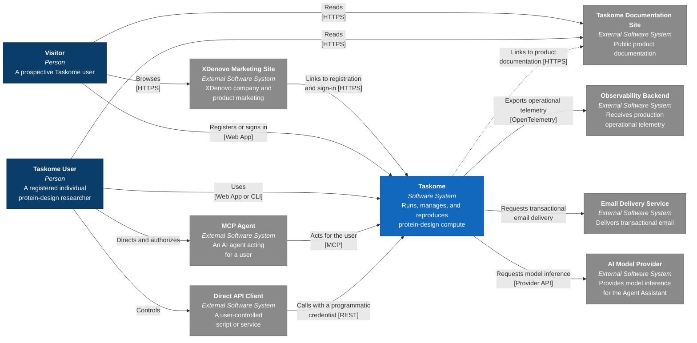

# System context

This page defines Taskome's accepted target system context for launch. It may
show relationships that are not implemented yet; source code and application
READMEs remain the authority for current behavior. Unresolved choices stay
explicit rather than appearing here as settled architecture.

This is the C4 Model's **System Context** level. Taskome appears as one software
system, surrounded by the people and external systems that interact with it.
Internal applications, services, data stores, and compute runtimes belong in
the Container view rather than this diagram.

## System context diagram

## People and access paths

| Element               | Relationship to Taskome                                                                                                                                    |
| --------------------- | ---------------------------------------------------------------------------------------------------------------------------------------------------------- |
| **Visitor**           | Learns about Taskome through the XDenovo Marketing Site, reads the public documentation, and may register or sign in through the Taskome Web App.          |
| **Taskome User**      | Uses an individual account through the Web App or Taskome's CLI. The same user may direct an MCP Agent or control a Direct API Client.                     |
| **MCP Agent**         | Calls Taskome's MCP interface with authority granted by the user it acts for. It is external to Taskome and distinct from the built-in Agent Assistant.    |
| **Direct API Client** | Calls Taskome's REST API with a scoped, revocable programmatic credential. It may be an interactive script, automated process, or user-controlled service. |

Taskome's CLI is not an external system. Taskome builds and distributes it as
part of the product, even though it runs on a user's machine. The built-in Agent
Assistant is also part of Taskome rather than another access channel.

## Adjacent websites

| System                         | Relationship to Taskome                                                                                                                                                                                             |
| ------------------------------ | ------------------------------------------------------------------------------------------------------------------------------------------------------------------------------------------------------------------- |
| **XDenovo Marketing Site**     | XDenovo's company and product marketing site. It provides links to Taskome registration and sign-in without sharing Taskome sessions or application data. Its repository application is `apps/web`.                 |
| **Taskome Documentation Site** | Public product documentation that can be opened directly or through links in Taskome. It does not participate in authentication, compute, or scientific-data lifecycles. Its repository application is `apps/docs`. |

The authenticated Taskome Web App is inside the Taskome boundary and currently
maps to `apps/console`. These repository locations do not determine the system
boundaries by themselves; the boundaries follow each application's product
responsibility and runtime relationship.

## External services and data boundaries

| System                     | Relationship to Taskome                                                            | Accepted boundary                                                                                                                                                                                |
| -------------------------- | ---------------------------------------------------------------------------------- | ------------------------------------------------------------------------------------------------------------------------------------------------------------------------------------------------ |
| **Observability Backend**  | Receives production operational telemetry through OpenTelemetry.                   | Telemetry excludes request bodies, credentials, Agent Assistant prompts, and scientific input or output content. The backend product remains undecided.                                          |
| **Email Delivery Service** | Delivers account verification and other transactional email requested by Taskome.  | It receives only the recipient address and the message data required for delivery, not Project, Job, or scientific-file data. The provider and transport remain undecided.                       |
| **AI Model Provider**      | Provides externally hosted model inference for Taskome's built-in Agent Assistant. | Taskome will not self-host the launch Assistant's general-purpose language model. The future Agent Assistant specification must decide what authorized user context may be sent to the provider. |

OpenTelemetry is the telemetry standard and transport boundary, not the name of
an external service. Development may use a locally operated viewer while
production uses a managed or separately operated backend without changing this
System Context relationship.

## What stays inside Taskome

The Taskome box includes the Web App, CLI, built-in Agent Assistant, API and MCP
capabilities, Tool runtimes, and the Upstream Software Taskome operates for
those Tools. Internal data stores, schedulers, workers, and deployment units do
not appear at the System Context level.

Packaging third-party Upstream Software does not make it an external system in
this diagram. A service belongs outside the boundary only when Taskome
communicates with an independently operated system at runtime.

## Related docs

- [`vision.md`](../product/vision.md) — product audience, launch boundary, and
  access channels.
- [`requirements.md`](../product/requirements.md) — checkable launch behavior
  for accounts, access, compute, files, and external-facing capabilities.
- [`CONTEXT.md`](../../CONTEXT.md) — canonical product and domain vocabulary.
- [`containers.md`](./containers.md) — accepted target containers, ownership,
  and dependency directions inside Taskome.
- [`docs/README.md`](../README.md) — documentation status and source-of-truth
  rules during the architecture rewrite.
