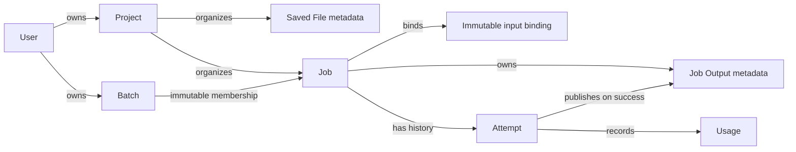

# Data ownership and consistency

This page defines Taskome's launch data architecture. It explains which system
is authoritative for each kind of data, how domain records belong to one
another, and which lifecycle and consistency rules every implementation must
preserve. It does not define database tables, Object Storage keys, transfer
protocols, or cleanup schedules.

## Use three meanings of ownership

Taskome uses "ownership" in three related but different ways:

- **System authority** identifies the system whose record decides Taskome's
  answer. PostgreSQL is authoritative for user-visible domain state, while
  Object Storage is authoritative for scientific file bytes.
- **User ownership** identifies the account allowed to discover and access a
  record. Launch data belongs to one individual user; Projects do not create a
  second authorization boundary or permit cross-user access.
- **Domain ownership** describes the record that controls another record's
  lifecycle and context. An Attempt belongs to a Job, for example, and a Job
  Output belongs to its Job even though a particular Attempt produced it.

Keeping these meanings separate prevents a Project, storage bucket, Temporal
Workflow, or Kubernetes Job from accidentally becoming a second source of
product truth.

## Keep one authority for each kind of data

| Data                                                                         | Authoritative system                                  | Domain relationship                                                                                    | Launch rule                                                                                                                           |
| ---------------------------------------------------------------------------- | ----------------------------------------------------- | ------------------------------------------------------------------------------------------------------ | ------------------------------------------------------------------------------------------------------------------------------------- |
| Authentication, authorization, and programmatic grants                       | Application Database                                  | Belong to one user                                                                                     | A grant can narrow the user's authority but cannot cross the user's ownership boundary.                                               |
| Tool catalog, contracts, versions, and execution snapshots                   | Application Database                                  | The catalog describes published Tools; each Job binds the immutable execution snapshot accepted for it | Runtime availability does not determine whether a Tool exists, and retrying a Job must not silently change its versions or resources. |
| Projects and Saved File metadata                                             | Application Database                                  | Each Saved File belongs to one user and exactly one Project                                            | Project assignment organizes data without changing ownership or provenance.                                                           |
| Batches and immutable membership                                             | Application Database                                  | A Batch belongs to one user and groups independent Jobs for one Tool                                   | A Batch owns no Attempt, Job Output, or execution lifecycle.                                                                          |
| Jobs, immutable input bindings, and Attempts                                 | Application Database                                  | Each Job belongs to one user and one Project; its Attempts belong to the Job                           | The Job request and its accepted input content stay fixed. Attempts remain distinct historical records.                               |
| Job Output metadata and provenance                                           | Application Database                                  | A Job Output belongs to its Job and identifies the successful Attempt that produced it                 | Only a successful Attempt can publish a Job Output. Published outputs are immutable.                                                  |
| Attempt usage                                                                | Application Database                                  | Usage is attributable to the user, Project, Job, and Attempt                                           | Success, failure, and cancellation all preserve the factual resource allocation and execution duration that occurred.                 |
| Transactional outbox records                                                 | Application Database                                  | Refer to the accepted domain operation they dispatch                                                   | An accepted Attempt or cancellation cannot disappear because another service was unavailable after the database commit.               |
| Saved scientific files, immutable Job inputs, and published Job Output bytes | Object Storage                                        | Correspond to metadata and provenance in the Application Database                                      | File bytes do not pass through PostgreSQL, Temporal payloads, or Kubernetes as durable product data.                                  |
| Attempt staging bytes                                                        | Object Storage                                        | Scoped to one Attempt until publication or cleanup                                                     | Staging data is not user-visible product data and is never a Job Output by itself.                                                    |
| Workflow history and scheduler state                                         | Temporal Service and Kubernetes Cluster, respectively | Correlate with an Attempt through derived identities                                                   | These systems own their internal state but never replace the Application Database as the Taskome domain store.                        |

The Web App and CLI may keep local interface state or user-selected local
files, but those copies do not become authoritative Taskome records. A Tool
Runtime receives references and scoped file access for one Attempt. It never
receives database credentials or owns user authorization data.

## Derive context through stable domain relationships

The domain model keeps execution history and provenance attached to the Job
that created them:

Every Job and Saved File belongs to exactly one Project. Attempts and Job
Outputs receive their Project context through their Job instead of carrying an
independent Project assignment. Moving a Job therefore moves the context in
which its Attempts and outputs appear without changing any identity, input,
history, or provenance. Moving a Saved File changes its organization, not its
owner or content history.

A Batch remains a user-owned grouping with immutable membership. Its member
Jobs can be inspected and reorganized independently because the Batch does not
own their lifecycle or results.

## Preserve immutable requests and provenance

A Job is the durable record of one accepted request. Its Tool, parameters,
input bindings, and execution snapshot do not change after acceptance. Every
Attempt under that Job refers to the same accepted request; executing a newer
Tool, Upstream Software version, or Runtime artifact requires a new Job.

An input binding identifies the exact scientific file content accepted for the
Job. Renaming, moving, editing, replacing, or removing the corresponding Saved
File later cannot change that binding or make the Job unreproducible. A user
can use a Saved File from one Project in a Job in another Project without
duplicating the stored bytes, but the two records keep their independent
Project context.

A successful Attempt can publish immutable Job Outputs. Each output remains
traceable to:

- its Job and the Attempt that produced it;
- the Job's immutable input bindings and parameter values;
- the accepted Tool contract and version;
- the Upstream Software version; and
- the immutable Runtime artifact and declared resources used by the Job.

Logs, temporary files, partial files, and staging bytes from a failed or
cancelled Attempt are not Job Outputs. Utilities may read, create, or edit
Saved Files without mutating the request, Attempt history, or provenance of an
existing Job.

## Let PostgreSQL decide product visibility

PostgreSQL is the commit point for user-visible Taskome state. Bytes existing
in Object Storage do not by themselves prove that a Saved File or Job Output
exists in the product.

This rule is especially important during output publication. A Tool Runtime
writes Attempt-scoped staging bytes, and Taskome verifies the reported objects
before committing the corresponding Job Output metadata and successful domain
state. Until that PostgreSQL transaction commits, the staging bytes remain
unpublished and invisible to callers. The detailed publication and
cancellation races belong in [`runtime.md`](./runtime.md).

PostgreSQL and Object Storage do not provide one distributed transaction.
Operations that cross them must instead be idempotent and recoverable through
reconciliation. The following cases have distinct meanings:

- **Bytes without committed product metadata** are staging, an incomplete
  operation, or orphaned data. They must not become visible by discovery alone.
- **Committed metadata whose referenced persistent bytes are missing** is a
  data-integrity incident. Taskome must report and reconcile the fault rather
  than silently treating it as a valid empty result or a successful deletion.
- **Duplicate delivery or recovery work** must reconnect to the same domain
  identity and converge on the committed PostgreSQL state rather than create a
  second Job Output or execute the same Attempt again.

PostgreSQL transactions keep changes inside the domain boundary atomic. Job
acceptance creates the Job, first Attempt, immutable input bindings, execution
snapshot, and outbox record together. Batch acceptance creates its membership
and member Jobs together. Output finalization creates the output records,
usage, and successful Attempt state together. The runtime view owns the exact
transition and compare-and-set rules.

## Retain history without inventing a deletion policy

Launch has several retention invariants even though it has no general
retention schedule:

- Terminal Attempts remain in their Job's history and are not overwritten by
  a later retry.
- Removing a Saved File from the file library must not remove content or input
  records still required by an existing Job.
- The Default Project cannot be archived or deleted. Another Project can be
  deleted only when empty, and Project deletion never cascades to Jobs,
  Attempts, Job Outputs, or Saved Files.
- Staging bytes from failed, cancelled, abandoned, or otherwise unpublished
  work never become product data and are eventually eligible for cleanup.

These rules do not imply that every record or object is retained forever. The
product has not yet defined general deletion behavior for Jobs and Job Outputs,
account deletion, legal holds, or numeric retention deadlines. An
implementation must resolve the applicable product and operational policy
before it deletes durable domain history or scientific bytes.

## Recover database records and file bytes coherently

The Application Database and Object Storage both contain durable product data
and both require backup and recovery. A recovery is valid only when database
metadata, provenance, and referenced file bytes form a logically consistent
set. Restoring PostgreSQL alone while losing referenced scientific files does
not restore Taskome's data.

Temporal persistence supports recovery of in-flight coordination, but it is
not a backup of Taskome's domain records. Kubernetes cluster state is
transient and cannot recover accepted Jobs or durable scientific files.
Deployment and runbook documentation must define the backup products,
schedules, restore order, verification, and operational response once
Taskome has numeric recovery objectives.

## Resolve implementation decisions in the owning section

The launch architecture intentionally leaves these choices open until the
corresponding feature or deployment design has enough evidence to decide them:

- how Saved File changes preserve historical content, such as immutable
  versions, snapshots, or content-addressed storage;
- how upload and download grants are scoped, expired, revoked, and verified;
- the Object Storage product, object-key layout, checksum algorithm, and
  physical deduplication boundary;
- upload lifecycle states and the validation point for supported format, size,
  and checksum;
- staging and orphan reconciliation mechanisms, schedules, and alerts;
- whether and how users delete or archive Jobs, Job Outputs, and other durable
  history;
- retention rules for Saved Files, Job Outputs, usage, outbox records, audit
  data, and deleted accounts;
- how historical usage is attributed when a Job moves between Projects; and
- backup retention, restore procedure, RPO, and RTO.

When implementation resolves one of these choices, remove it from this list
and update the existing section that owns the decision. Prefer extending the
current ownership, lifecycle, consistency, retention, or recovery explanation
over adding a new section for each implementation detail. Add a section only
when the decision introduces a genuinely separate architectural concern.

## Related docs

- [`overview.md`](./overview.md) — the architecture strategy and separation of
  domain truth from execution machinery.
- [`containers.md`](./containers.md) — container responsibilities, data
  ownership, and dependency directions.
- [`runtime.md`](./runtime.md) — Job and Attempt state, acceptance,
  cancellation, retry, and output publication.
- [`requirements.md`](../product/requirements.md) — product requirements for
  Projects, Jobs, Attempts, provenance, files, and usage.
- [`CONTEXT.md`](../../CONTEXT.md) — canonical definitions of Taskome's domain
  terms.
- [`constraints.md`](./constraints.md) — confirmed operational and release
  constraints, including the absence of numeric recovery objectives.
