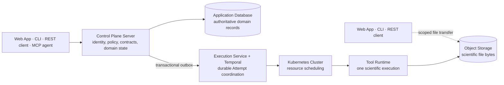

# Architecture overview

This page explains Taskome's accepted target architecture for launch and the
decisions that shape it. It is an architecture explanation page for engineers
who need the system's mental model before reading detailed runtime, data, or
deployment designs.

The target is ahead of the repository. The current code implements the Web App,
Control Plane Server, and PostgreSQL foundation; the compute execution path and
scientific-file storage are not implemented yet. Source code, migrations,
executable configuration, and application READMEs remain authoritative for
current behavior.

## Architecture at a glance

Taskome separates product-facing control from scientific execution:

The Control Plane Server owns identity, authorization, external REST and MCP
interfaces, Tool contracts, and Taskome's domain operations. It accepts work
but does not run scientific software. The Execution Service turns an accepted
Attempt into durable coordination, Kubernetes assigns the declared compute
resources, and one immutable Tool Runtime performs the scientific execution.

PostgreSQL remains authoritative for user-visible state. Temporal and
Kubernetes own workflow and scheduler state only. Object Storage owns
scientific file bytes, while PostgreSQL records their identity, ownership,
lifecycle, and provenance.

## Architectural decision drivers

The launch architecture optimizes for these outcomes:

- **Trustworthy scientific records.** Every Job keeps immutable inputs and
  parameters. Every execution has its own Attempt, and every Job Output remains
  traceable to the exact Tool, Upstream Software, inputs, parameters, and
  Attempt that produced it.
- **No silent loss after acceptance.** An accepted Job remains queryable as a
  non-terminal state, a result, or an explicit failure. Process restarts and
  coordination retries must not make accepted work disappear.
- **Private, least-authority access.** Every operation is evaluated against one
  user identity and, for programmatic access, explicit scopes. Tool Runtimes do
  not receive database credentials or user authorization data.
- **One product model across access channels.** Web, CLI, REST, and MCP may use
  channel-appropriate interfaces, but they preserve the same Tool, Job,
  Attempt, Batch, Project, file, and provenance semantics.
- **A growing curated Tool catalog.** Adding a Tool should primarily require a
  reviewed contract, declared resources, an immutable Runtime artifact, and
  integration tests against stable platform seams—not a new control plane.
- **Operationally explicit boundaries.** Domain persistence, durable workflow
  coordination, resource scheduling, and scientific execution remain separate
  responsibilities so failures can be diagnosed and recovered at the right
  layer.

The product requirements set no numeric launch target for latency, throughput,
or availability. That absence does not permit silent loss, duplicate execution
of one Attempt, incomplete provenance, or weakened user isolation.

## Keep one control plane for product policy

The Control Plane Server is the product boundary for all external operations.
It owns authentication, authorization, Taskome domain state, Tool discovery,
REST, MCP, file-access grants, and the Agent Assistant backend. The Web App and
CLI are clients of this server; neither owns a second copy of business policy.

REST and MCP are adapters over the same application behavior rather than
interfaces exposed independently by each Tool Runtime. This keeps
channel-specific transport concerns at the edge while preventing differences
in Job or Attempt semantics between human and agent access.

The built-in Agent Assistant follows the same boundary. The Web App owns its
interface, while the Control Plane Server authorizes every operation and
decides what user context may cross the external AI Model Provider boundary.

## Separate domain truth from execution machinery

Taskome uses three different identities for three different responsibilities:

| Layer                 | Role                                                                                                         |
| --------------------- | ------------------------------------------------------------------------------------------------------------ |
| **Taskome Attempt**   | Durable, user-visible record of one actual execution of a Job.                                               |
| **Temporal Workflow** | Durable coordination for that Attempt, including timers, recovery, and idempotent infrastructure operations. |
| **Kubernetes Job**    | Resource-scheduled workload that runs the Tool Runtime for that Attempt.                                     |

The Attempt is the product record. Temporal does not replace it, and
Kubernetes does not become the source of truth for it. Workflow and Kubernetes
Job identities derive from the Attempt ID so coordination can reconnect to
existing work after a retry instead of launching another scientific execution.

Every actual re-execution creates a new Attempt. Infrastructure may retry safe
coordination operations under the same Attempt, but it must not execute the
Tool Runtime twice concurrently or silently repeat scientific compute under
one Attempt identity.

## Cross the acceptance boundary durably

Accepting an Attempt requires a PostgreSQL write, while starting its workflow
requires a call to Temporal. Taskome bridges that boundary with a transactional
outbox:

1. The Control Plane Server writes the Attempt and outbox record in one
   database transaction.
2. The Execution Service claims committed outbox records and starts the
   Attempt's Temporal Workflow.
3. Starting the same workflow more than once is safe because its identity
   derives from the Attempt ID.

This boundary prevents an accepted Attempt from disappearing when a process
stops between the database commit and workflow start. Temporal then coordinates
the Attempt durably, while Kubernetes handles compute placement and
concurrency.

## Package each Tool as an immutable Runtime

The Control Plane Server publishes Tools from approved manifests instead of
discovering their contracts from live compute processes. A Tool can therefore
remain discoverable when its Runtime is unavailable.

Each published Tool binds:

- its curated input, parameter, and output contract;
- the Tool and Upstream Software versions;
- declared CPU, GPU, and custom resources; and
- an immutable identifier for its Runtime artifact.

A Tool Runtime contains the scientific software and dependencies needed for
one Attempt. It receives immutable inputs and parameters, reads and publishes
scientific files through Object Storage, and returns execution metadata and
output references. It cannot access the Application Database or make
authorization decisions.

One Runtime may support more than one Tool only when those Tools share the same
Upstream Software, dependencies, artifact, and deployment lifecycle. Taskome
does not expose the Runtime itself as a public REST or MCP service.

Each Runtime is an OCI image stored in GitHub Container Registry. Published
Tools bind its immutable digest rather than relying on a mutable tag. The
repository layout, uv/Pixi dependency split, upstream source tracking, and
image contract belong in
[`components/tool-runtime.md`](./components/tool-runtime.md).

## Keep file bytes out of control and workflow traffic

The Control Plane Server authorizes short-lived, scoped file access and stores
file metadata. Web, CLI, and Direct API clients transfer supported file bytes
directly to or from Object Storage. MCP returns safe inline content or a
download reference instead of placing large scientific files in an agent's
context.

Temporal payloads, Kubernetes Job submissions, and Tool Runtime results carry
identifiers, parameters, metadata, and file references—not large file
contents. Temporary values in a Tool Runtime's ephemeral container workspace
do not become saved files or Job Outputs until a Tool Runtime publishes them
to Taskome's durable Object Storage.

This split preserves immutable Job inputs and outputs without turning the
Control Plane Server, Temporal, or Kubernetes into a binary-file transport.

## Current implementation and target architecture

| Area                        | Current repository state                                                           | Accepted launch target                                                                                             |
| --------------------------- | ---------------------------------------------------------------------------------- | ------------------------------------------------------------------------------------------------------------------ |
| **Web experience**          | `apps/console` implements the authenticated Web App foundation.                    | Web App provides the launch browser journeys, Utilities, and Agent Assistant UI.                                   |
| **Control plane**           | `apps/server` provides a Hono API, Better Auth, and PostgreSQL access.             | Server owns domain operations, authorization, REST, MCP, Tool catalog, file grants, and Assistant backend.         |
| **Domain persistence**      | PostgreSQL and Drizzle migrations support the current server.                      | PostgreSQL stores authoritative authentication, domain, provenance, outbox, and usage records.                     |
| **Execution coordination**  | Execution Service and Temporal are not present.                                    | Execution Service dispatches the outbox and durably coordinates one Temporal Workflow per Attempt.                 |
| **Resource scheduling**     | Kubernetes is not present.                                                         | Kubernetes schedules every Attempt against its Tool's declared resources as a Kubernetes Job.                      |
| **Scientific execution**    | `runtimes/fpocket` provides a locked image skeleton without an Attempt entrypoint. | One immutable OCI Runtime from `runtimes/<upstream>` performs the scientific execution for an Attempt.             |
| **Scientific-file storage** | Object Storage is not present.                                                     | Object Storage holds saved scientific files, immutable Job inputs, and Job Outputs; the product remains undecided. |

The target column records accepted responsibilities, not a claim that the
components already run. New implementation must preserve these boundaries;
temporary milestone code must stay recognizable as temporary and must not
silently redefine the target architecture.

## Keep unresolved choices visible

The following decisions are not settled by this overview:

- Temporal Cloud or a self-hosted Temporal Service;
- the Object Storage product and provider;
- the Kubernetes distribution and node-management platform;
- Tool Runtime signing, scanning, retention, and promotion policy;
- production hosting, public ingress, and TLS termination;
- additional account authentication methods, exact authorization scope names,
  credential lifetimes, and security-control mechanisms;
- detailed Job and Attempt states, retry limits, cancellation races, and
  timeout behavior; and
- numeric scaling, availability, and performance targets.

Resolve these choices in the page that owns the concern. Use an ADR only when
a decision is difficult to reverse, surprising without its trade-off context,
or needs durable rationale beyond the architecture page.

## Related docs

- [`context.md`](./context.md) — Taskome's system boundary, people, access paths,
  and external systems.
- [`containers.md`](./containers.md) — deployable units, data ownership, and
  dependency directions.
- [`requirements.md`](../product/requirements.md) — checkable launch behavior
  that drives this architecture.
- [`vision.md`](../product/vision.md) — product scope, audience, and non-goals.
- [`CONTEXT.md`](../../CONTEXT.md) — canonical domain vocabulary.
- [`runtime.md`](./runtime.md) — Job and Attempt submission, execution,
  cancellation, failure recovery, retry, and result publication.
- [`components/tool-runtime.md`](./components/tool-runtime.md) — Runtime
  repository layout, upstream packaging, image contract, and verification.
- [`data.md`](./data.md) — data ownership, lifecycle, and consistency.
- [`security.md`](./security.md) — identity, authorization, trust boundaries,
  and least-authority rules.
- [`docs/README.md`](../README.md) — document status and source-of-truth rules
  during the architecture rewrite.
