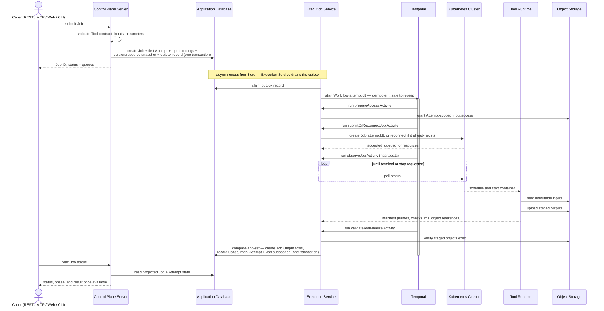
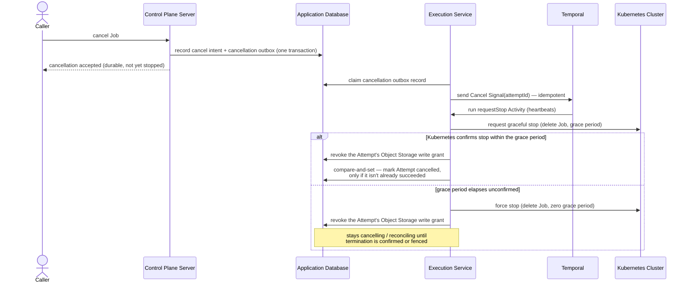

# Runtime view

This page explains how Taskome accepts a Job, executes it, and publishes its result — the complete path from submission through cancellation, failure, retry, and output publication. File upload, download, retention, and deletion belong to [`data.md`](./data.md). Resolving a caller to an identity belongs to `security.md`. Container names match [`containers.md`](./containers.md) exactly.

Every Access Channel shares one lifecycle. REST and MCP both return a Job identifier once the Job is durably accepted, then let the caller query status. The Web App may add Server-Sent Events or a similar live-update experience, but that is a convenience layer over the same durable state, not a different lifecycle.

> **Target architecture, not shipped code.** Nothing on this page exists in the repository yet. PostgreSQL is the only supporting service in the current `compose.yml`; the Execution Service, Temporal, Kubernetes, Object Storage, and every Tool Runtime remain unimplemented. This page describes the accepted design those components must follow when they're built — see [`overview.md`](./overview.md) and [`containers.md`](./containers.md) for the container-level decisions this page assumes.

## Attempt lifecycle and state

A **Job** is an immutable request. An **Attempt** is one accepted try to carry it out, created in the same transaction that accepts the Job — before any compute resource is available. An Attempt can reach a terminal state without ever running scientific software, for example when it's cancelled while still queued; `started_at` stays nullable, and a cancellation before start records zero execution duration.

A Job has at most one non-terminal Attempt at a time. Terminal Attempts are immutable and stay in the Job's history — retrying a failed or cancelled Job creates another Attempt under the same Job, never a replacement Job and never an overwritten Attempt.

| Status       | Terminal? | Meaning                                                                  |
| ------------ | --------- | ------------------------------------------------------------------------ |
| `queued`     | No        | Accepted; waiting for a Workflow to start or for compute resources.      |
| `running`    | No        | A Workflow is actively coordinating this Attempt's execution.            |
| `cancelling` | No        | A cancel request is durable; the workload's stop is not yet confirmed.   |
| `succeeded`  | Yes       | Outputs are published and immutable.                                     |
| `failed`     | Yes       | Terminated without publishing outputs; carries a `failure_kind` (below). |
| `cancelled`  | Yes       | Stopped at the caller's request before it could succeed.                 |

PostgreSQL is the only user-facing state authority. Callers never derive Taskome status from Temporal or Kubernetes directly — both may be temporarily unreachable, replaying history, or mid-recovery without that being true of the Attempt itself.

A Job's status is a projection of its current Attempt's status, maintained in the same transactions that transition the Attempt. Infrastructure detail that doesn't change the product-visible status — waiting for resources, reconnecting after a restart, confirming a stop — is recorded as a non-terminal **phase**, not as an additional public terminal state:

| Non-terminal status | Example phases                    |
| ------------------- | --------------------------------- |
| `queued`            | `awaiting_resources`, `preparing` |
| `running`           | `executing`, `publishing`         |
| `cancelling`        | `stopping`, `reconciling`         |

Submitting a Job returns only the Job ID. Attempt history, including any Attempt's phase, is discoverable by querying the Job — a caller doesn't need to think in Attempts to submit or poll one.

Every Attempt under a Job reuses the exact execution snapshot pinned when the Job was created: the Tool contract version, Upstream Software versions, the Runtime artifact digest, and the declared CPU/GPU/custom resources. Running a newer version is a new Job, never a silent change to what "retry" means for an existing one.

## Accept work durably

Accepting a Job crosses two systems: a PostgreSQL write and, eventually, a Temporal Workflow start. Taskome bridges that boundary with a transactional outbox — not a general-purpose queue, but a way to make one write and one downstream call happen atomically from the caller's point of view.

1. The Control Plane Server validates the Tool contract, inputs, and parameters _before_ writing anything. A validation failure creates no Job and no Attempt.
2. On success, it creates the Job, the first Attempt, immutable input bindings, the version/resource snapshot, and an outbox record — all in one PostgreSQL transaction.
3. It returns the Job ID only after that transaction commits. Temporal or Kubernetes being unavailable at this moment doesn't affect whether the Job is accepted.
4. The Execution Service claims unprocessed outbox records and starts each Attempt's Workflow. Because the Workflow ID is derived from the Attempt ID, starting it twice is safe — duplicate dispatch reconnects rather than duplicating work.

This outbox is a reliability seam, not another scheduler. Temporal owns durable coordination after dispatch, and Kubernetes owns resource-aware compute scheduling. There's no reason to put a message broker such as Redis between them — Temporal already persists its own state and already queues work through Task Queues, so a second durable queue in front of it would add a failure mode without adding a guarantee.

## Orchestrate with one Workflow per Attempt

Taskome binds Temporal and the Kubernetes API directly through their SDKs rather than through an internal adapter layer — the problem Taskome needs solved (durably coordinate a possibly long-running, possibly failing external workload, safely across process restarts) is the problem Temporal's Workflow/Activity model exists for, and no second orchestration engine is anticipated.

One Attempt maps to one Temporal Workflow and one Kubernetes Job:

- The **Workflow ID** is derived from the Attempt ID. Every Run in that Workflow's chain — including any produced by Continue-As-New — is internal coordination for the same Attempt. A new Run ID never means a new Attempt.
- The **Kubernetes Job name** is derived from the Attempt ID as well. Because Kubernetes rejects creating a Job with a name that already exists, reconnecting to an already-created Job (rather than recreating it) is what makes Temporal's automatic Activity retry safe.

Workflow code stays deterministic — it decides what happens next, but never performs I/O directly. Every side-effecting step is its own Activity:

| Activity               | Does                                                                                                                                   | Idempotency                                                                                           |
| ---------------------- | -------------------------------------------------------------------------------------------------------------------------------------- | ----------------------------------------------------------------------------------------------------- |
| `prepareAccess`        | Grants Attempt-scoped, least-authority input access.                                                                                   | Re-granting the same scope is a no-op.                                                                |
| `submitOrReconnectJob` | Looks up the Attempt's Kubernetes Job name; creates the Job only if it doesn't already exist.                                          | Safe to retry — a retry always finds the existing Job instead of recreating it.                       |
| `observeJob`           | Polls Kubernetes Job/Pod status until a terminal state or a stop request. Heartbeats throughout.                                       | Reconnects to the same Job name; never launches a second workload.                                    |
| `requestStop`          | Requests a graceful Kubernetes Job stop (delete with a grace period), then forces deletion after a deployment-configured grace period. | Heartbeats throughout, so a Cancel Signal can interrupt it.                                           |
| `validateAndFinalize`  | Validates the output manifest and object existence, then finalizes domain state.                                                       | A single compare-and-set Postgres transaction — safe to retry; a losing race is a no-op, not a retry. |

`observeJob` and `requestStop` can run for a long time, so both heartbeat on a regular interval (for example, every 10–30 seconds) with a Heartbeat Timeout of two to three times that interval. Without a heartbeat, Temporal has no channel to deliver a cancellation into a running Activity.

Launch runs every Execution Service deployment against a single Temporal Task Queue. Activities are lightweight orchestration calls — they call the Kubernetes API and write to Postgres, not run compute themselves — so there's no resource-aware reason yet to route them to separate queues; Kubernetes already owns resource-aware placement.

## Cancel without guessing whether it worked

A cancel request targets the Job's current non-terminal Attempt. "Accepted" means the request is durable, not that the workload has stopped:

1. The Control Plane Server records a cancel intent and a cancellation outbox entry in one PostgreSQL transaction, then returns "accepted."
2. The Execution Service claims that outbox entry and sends an application-defined **Cancel Signal** into the Attempt's Workflow — idempotently, so a repeated cancel request is harmless.
3. Signals, not Temporal's native Cancel API, carry cancellation. A Signal is durably delivered even if the Workflow isn't actively waiting for it at the moment it's sent, and keeps "cancellation is durable" fully inside Taskome's own state machine instead of Temporal's built-in cancellation propagation.
4. The Workflow runs `requestStop`: graceful stop first, forced stop after the grace period, heartbeating throughout so the Signal can interrupt it.

**Success and cancellation racing.** A PostgreSQL compare-and-set decides the winner. If `validateAndFinalize`'s transaction commits first, the Attempt is already `succeeded`; the cancellation's compare-and-set then finds no non-terminal Attempt to act on and no-ops. If the cancel intent commits first, `validateAndFinalize`'s compare-and-set fails instead, staged outputs stay unpublished, and the Attempt becomes `cancelled` once termination is confirmed. Either outcome is an expected branch of the design, not an error — a losing compare-and-set must not be recorded as an Activity failure, or Temporal's error telemetry fills up with noise from a race that's supposed to happen.

**Fencing a workload Taskome can't confirm has stopped.** The moment the cancel intent is durable, Taskome revokes the Attempt's Object Storage write grant. Even if the old workload is still alive and finishes anyway, its publish attempt is rejected at the storage layer — fencing happens where Taskome already controls access (Object Storage), rather than depending on a stop confirmation from Kubernetes that might never arrive.

## Treat unclear scheduler state as unresolved, not failed

A Kubernetes Job's state lives in the cluster's own store: if the Job object is confirmed deleted, or the node running its Pod is confirmed lost, the workload is gone with it. But losing connectivity to the Kubernetes API server and losing the Job itself are different events, and Taskome must not treat them the same way:

- **The Kubernetes Job's identity is unchanged**, but the API call failed, timed out, or the API server is temporarily unreachable. This is transient — the control plane being briefly unavailable does not by itself stop an already-scheduled Pod from continuing to run on its node. Keep the Attempt in a `reconciling` phase and keep retrying observation with backoff. Never recreate the same Attempt's Job just because a status check failed.
- **The Kubernetes Job itself is confirmed deleted, or the node running its Pod is confirmed lost** — an authoritative signal from the Kubernetes API (the Job is absent, or the node is marked unready past its eviction timeout) or from deployment/infrastructure lifecycle, not a guess from a timeout. Only then is the old workload reliably fenced: the Attempt can be marked `failed` with `failure_kind = infrastructure`, and the user can explicitly retry, creating a new Attempt.

A connection timeout alone never qualifies as "reliably fenced." Without an authoritative signal, the Attempt stays `reconciling` and escalates to operational recovery rather than resolving itself.

## Retry only when a person or policy decides to

Launch creates no Attempt automatically — not as a coordination retry disguised as re-execution, and not as an automatic response to a platform failure. Every retry is an explicit, user-initiated action:

- A retry is accepted only when the Job is `failed` or `cancelled` and has no non-terminal Attempt. A successful Job is run again by creating a new Job, not by retrying.
- There's no architecture-level limit on lifetime retry count; rate or abuse policy can be layered on separately.
- The caller supplies an Idempotency-Key with a retry request, so a request repeated after a network failure reconnects to the same retry attempt instead of creating two Attempts.

Every terminal `failed` Attempt carries a `failure_kind`, distinguishing at minimum: Tool/runtime failure, infrastructure failure, timeout, configuration failure, and output-publication failure. This classification exists at launch even though nothing acts on it automatically yet — it's what lets a future automatic-retry policy (`JOB-003` in [`requirements.md`](../product/requirements.md) already anticipates one) retry only the platform's own faults, and what lets a future billing model exclude platform-caused failures from a user's usage. Neither policy is decided by this page; only the data they'd need is.

## Bound waiting and execution with the right clock

- **Queue waiting has no default deadline.** An Attempt waiting for CPU or GPU capacity stays visible as `queued` indefinitely, matching how AWS Batch and Kubernetes both treat resource waiting by default. A missing Runtime artifact or an invalid manifest is a configuration failure, not indefinite capacity waiting, and fails immediately instead of queuing.
- **Execution timeout is per-Tool and per-Attempt.** Every published Tool version declares a maximum execution duration, snapshotted into the Job and Attempt. It's measured from the confirmed Runtime start, excluding queue time. Expiration runs the same graceful-then-forced stop as cancellation and ends in `failed` with `failure_kind = execution_timeout` — it never creates an automatic retry.
- **The Workflow itself has no wall-clock execution timeout.** Individual Activities have their own retry and backoff policies, but the Workflow doesn't expire just because resource waiting or compute legitimately takes a long time. If a stop can't be confirmed within its grace period, the Attempt moves to `reconciling` — Taskome never invents a terminal outcome from a wall-clock deadline it can't back with a confirmed fact.

## Publish outputs only after they're verified

A Runtime never writes directly to the product-visible output set. Publication is a four-step, staged-then-committed flow:

1. The Runtime uploads outputs to Attempt-scoped staging objects.
2. It returns a manifest: output names, types, checksums, sizes, object references, and execution metadata.
3. The Execution Service validates the manifest and confirms the staged objects exist.
4. One idempotent PostgreSQL transaction creates the immutable Job Output rows, records usage, and marks the Attempt and Job `succeeded`.

Bytes can exist in staging before step 4 completes, but they aren't Job Outputs and aren't visible to any caller until that transaction commits. Staging from a failed or cancelled Attempt is cleaned up later and never published.

Each Runtime receives only Attempt-scoped, least-authority storage access: it can read its own immutable inputs and write only its own staging namespace, with no user or database credential of any kind. The storage product, grant mechanism, and cleanup schedule belong to [`data.md`](./data.md).

## Report progress without inventing a percentage

Taskome guarantees a durable lifecycle status and a coarse phase (the table under [Attempt lifecycle and state](#attempt-lifecycle-and-state)) — not a universal completion percentage. A Tool may expose its own progress signal only when it has a denominator that's actually meaningful for that Tool; nothing forces every Tool to report one.

The durable state transition and the latest phase live in PostgreSQL. REST and MCP query that same projection. If the Web App adds Server-Sent Events, it's a convenience layer over this projection — reconnecting or falling back to polling must land on the same answer, never a different one.

## Accept and roll up a Batch without giving it a lifecycle

Submitting a Batch validates every member first; if any member is invalid, the whole Batch is rejected. On success, one transaction atomically creates the Batch, its immutable membership, every member Job, each Job's first Attempt, and every outbox record.

A Batch has no lifecycle of its own. Taskome doesn't persist an independent Batch state machine, a Batch-level Attempt, a Batch-level output, an average progress figure, or an execution dependency between members. Aggregate progress is derived or cached from member Job states — a `terminal / total` count, refreshed as members transition — not tracked as its own source of truth. One member's failure, cancellation, or retry never changes another member's lifecycle or result.

## Write execution state directly, with least privilege

The Execution Service writes to PostgreSQL directly, through a narrow domain-transition module and a least-privilege database role scoped to the writes it's allowed to make: Attempt state transitions, usage recording, and output finalization. It doesn't route those writes through an internal HTTP call to the Control Plane Server.

This keeps the compare-and-set transactions above — the success/cancellation race, `validateAndFinalize`'s idempotent finalize — inside a single database transaction instead of splitting them across a network call, which would either push all of that transactional logic into a private API the Control Plane Server has to understand in Execution Service's own terms, or reintroduce a distributed-transaction problem in a different place. Database transactions, constraints, and compare-and-set conditions are what resolve the races on this page; an internal service boundary wouldn't remove any of them.

## Related docs

- [`overview.md`](./overview.md) — the architecture strategy this page implements, including the outbox and Attempt/Workflow/Kubernetes Job identity model.
- [`containers.md`](./containers.md) — container responsibilities and data ownership this page assumes.
- [`data.md`](./data.md) — Object Storage lifecycle, presigned access, and retention for inputs and outputs.
- [`CONTEXT.md`](../../CONTEXT.md) — canonical definitions of Job, Attempt, Job Output, and Batch.
- [`docs/product/requirements.md`](../product/requirements.md) — the checkable behavior this design satisfies, especially `JOB-001..006`, `BATCH-001..005`, `PROV-001..003`, and `EXEC-001..004`.
