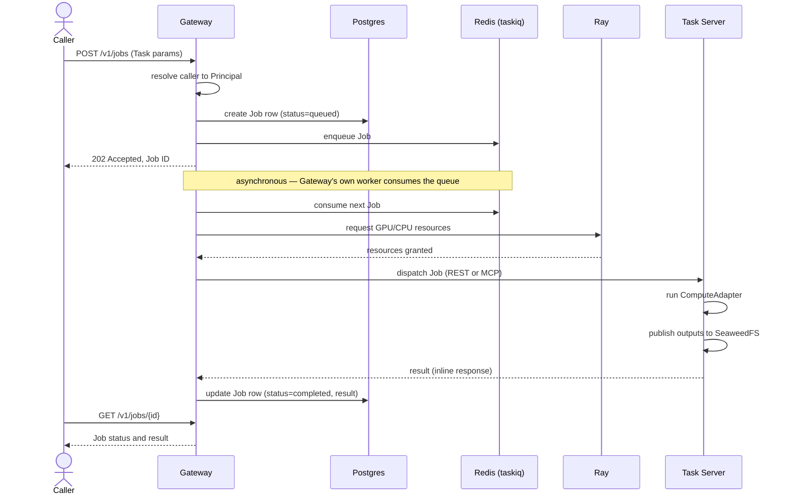
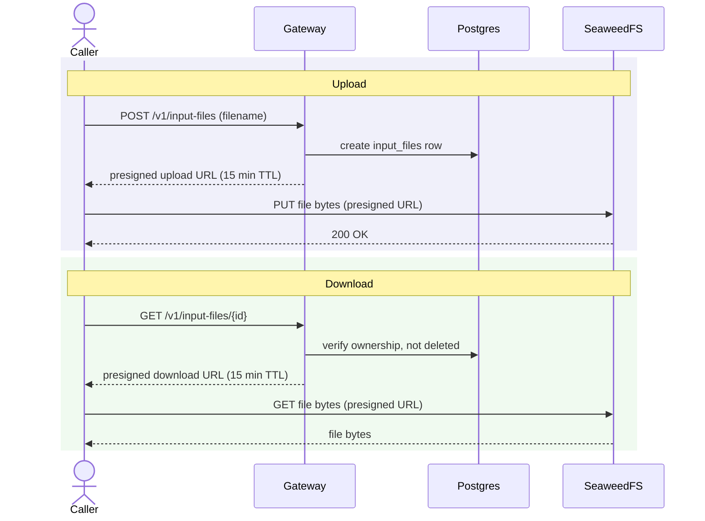

# Runtime view

Two flows, end to end: submitting a Job and getting its result, and moving an Input File in or out of storage. Container names here match [`containers.md`](./containers.md) exactly.

## Job dispatch

Submitting a Job returns immediately once it's durably queued — not once it's finished. GPU compute can take a long time, and vision.md already treats a Job as something with its own ongoing status, not a single request/response round trip. The Caller polls for the result rather than holding a connection open or waiting on a callback; there's no completion webhook. Note that this durability guarantee only covers the Caller → Gateway leg: the Gateway → Task Server dispatch later in this diagram is a plain blocking call with no queue behind it, and a lost connection there loses the result — see [`integrations.md`](./integrations.md) for that accepted trade-off.

> **Status note (delete once built):** This entire flow, from "enqueue" onward, is target design — see `containers.md`'s Job execution section for exactly what exists in code today (short answer: none of the queue-to-dispatch path).

## Input File upload and download

Gateway never sees the file's bytes in either direction — it only ever mints a short-lived, ownership-checked URL. This part is implemented today (unlike Job dispatch above); see [`data.md`](./data.md) for the retention rules and exact TTL this diagram references.

## Related docs

- [`containers.md`](./containers.md) — the containers these sequences run across.
- [`data.md`](./data.md) — Input File retention and the presigned URL TTL.
- [`integrations.md`](./integrations.md) — why Job dispatch has no completion webhook.
- [`security.md`](./security.md) — what "resolve caller to Principal" actually checks.
- [`docs/adr/0004-gateway-owned-job-dispatch.md`](../adr/0004-gateway-owned-job-dispatch.md) — the job-dispatch decision behind these flows.
- [`docs/adr/0005-seaweedfs-storage-and-presigned-urls.md`](../adr/0005-seaweedfs-storage-and-presigned-urls.md) — the presigned-URL decision behind these flows.
