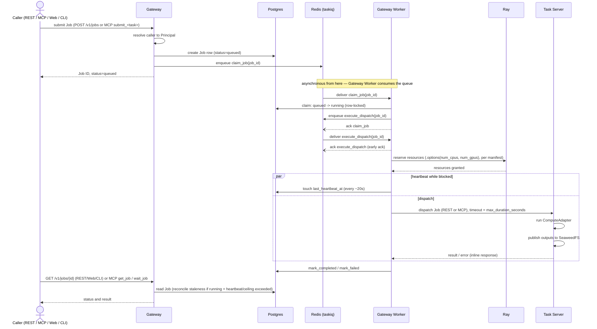
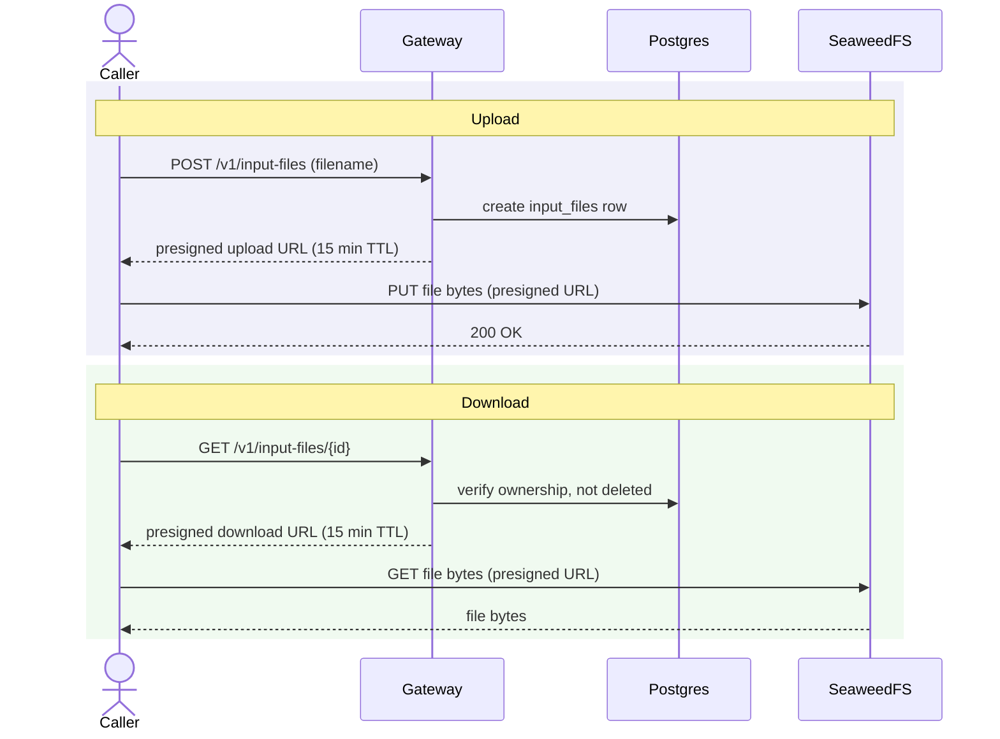

# Runtime view

Two flows, end to end: submitting a Job and getting its result, and moving an Input File in or out of storage. Container names here match [`containers.md`](./containers.md) exactly.

## Job dispatch

Submitting a Job returns immediately once it's durably queued — not once it's finished. GPU compute can take a long time, and vision.md already treats a Job as something with its own ongoing status, not a single request/response round trip. Every access channel shares this same shape: REST gets `202 Accepted` + a Job ID and polls `GET /v1/jobs/{id}`; MCP's `submit_<task>` returns `job_id` the same way, and either polls with `get_job` or blocks server-side (with a timeout that never errors, just returns current status) via `wait_job`. There's no completion webhook in either direction — not Task Server back to Gateway, and not Gateway back to the original caller.

Retries only ever happen inside `execute_dispatch`, and only for a failure known not to have reached the Task Server (connection refused, DNS failure) — see [ADR-0008](../adr/0008-taskiq-ray-async-job-dispatch.md) for why a failure that might have reached the Task Server is treated as terminal instead of retried, and why `claim_job` and `execute_dispatch` are split into two tasks rather than one retried task. If the Worker process dies mid-`execute_dispatch` (after acking, before writing a terminal state), there's no automatic recovery — the heartbeat/ceiling staleness check surfaces this on the caller's next read, and the caller resubmits. This is the same accepted risk [ADR-0004](../adr/0004-gateway-owned-job-dispatch.md) names for the Gateway → Task Server leg, unchanged by this design.

> **Status note (delete once built):** This diagram is target design from ADR-0008. What exists in code today: the Job data model, REST `POST /v1/jobs` (`202` + in-process `asyncio.create_task` dispatch, not a queue) and `GET /v1/jobs/{id}`, and an MCP surface that still dispatches synchronously (`submit_job_and_wait`) rather than the `submit`/`get_job`/`wait_job` split shown here. No taskiq usage, no Gateway Worker process, and nothing calls Ray yet — see `containers.md`'s Job execution section.

## Input File upload and download

Gateway never sees the file's bytes in either direction — it only ever mints a short-lived, ownership-checked URL. This part is implemented today (unlike Job dispatch above); see [`data.md`](./data.md) for the retention rules and exact TTL this diagram references.

## Related docs

- [`containers.md`](./containers.md) — the containers these sequences run across.
- [`data.md`](./data.md) — Input File retention and the presigned URL TTL.
- [`integrations.md`](./integrations.md) — why Job dispatch has no completion webhook.
- [`security.md`](./security.md) — what "resolve caller to Principal" actually checks.
- [`docs/adr/0004-gateway-owned-job-dispatch.md`](../adr/0004-gateway-owned-job-dispatch.md) — the job-dispatch decision behind these flows.
- [`docs/adr/0008-taskiq-ray-async-job-dispatch.md`](../adr/0008-taskiq-ray-async-job-dispatch.md) — the claim/execute task chain, Ray brokering, and MCP tool shape behind the Job dispatch diagram above.
- [`docs/adr/0005-seaweedfs-storage-and-presigned-urls.md`](../adr/0005-seaweedfs-storage-and-presigned-urls.md) — the presigned-URL decision behind these flows.
