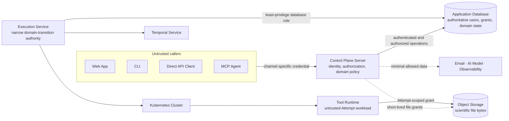

# Security and trust boundaries

This page defines Taskome's launch security architecture. It is the design
contract for engineers and agents implementing identity, authorization,
credential handling, scientific execution, and external integrations. It does
not document current behavior or prescribe exact token lifetimes, scope names,
network products, or secret-delivery mechanisms.

## Protect ownership before adding capabilities

Taskome's launch security model prioritizes five outcomes:

1. One user cannot discover, read, modify, or delete another user's data.
2. A credential grants only explicit authority and stops working immediately
   after its revocation commits.
3. Each client, service, Runtime, and external provider receives only the data
   and permissions needed for its current operation.
4. Job inputs, Attempt history, Job Outputs, usage, and provenance cannot be
   changed without an authorized domain operation.
5. Credentials, scientific contents, and Assistant prompts do not leak through
   logs or unrelated systems.

Launch uses flat individual accounts. It has no organizations, teams, roles,
cross-user sharing, product administrator, or user-impersonation path. A
Project organizes one user's data but never becomes a second authorization
boundary.

## Treat every boundary as untrusted

The design assumes that Taskome may receive requests or data from:

- an unauthenticated public caller;
- an authenticated user attempting to access another user's resources;
- a client using a leaked, expired, revoked, or over-scoped credential;
- an MCP Agent, Direct API Client, CLI environment, or browser extension that
  does not fully deserve the user's trust;
- malformed or malicious scientific files;
- defective, malicious, or compromised Tool Runtime and Upstream Software; or
- an external provider that receives more Taskome context than its role needs.

Replay, duplicated delivery, and use of a valid credential at the wrong
resource are part of the threat model. A fully malicious production host,
cloud administrator, or database administrator is outside the protection an
application authorization check can provide. Deployment limits that exposure
through separate infrastructure access and an auditable break-glass path.

## Route product authority through the Control Plane

All product-facing operations cross the Control Plane Server. External clients
never gain direct domain-database access, and internal execution components do
not reinterpret user permissions.



The absence of an arrow is intentional. In particular, a Tool Runtime does not
reach the Application Database, external clients do not call Temporal or
Kubernetes, and user credentials do not cross into execution infrastructure or
external providers.

## Resolve every request to one security context

Before a protected application operation runs, the Control Plane resolves the
presented credential to a security context containing:

- one user identity;
- the user's email-verification state;
- for programmatic access, the grant or credential identity and explicit
  scopes; and
- request correlation data needed for security audit events.

The Access Channel remains available for protocol validation and auditing, but
it does not change resource ownership. Launch does not add a role, team, or
organization principal.

Every domain authorization evaluates the same intersection:

```text
allowed = authenticated user owns target
          AND current session or grant permits the operation
          AND product gates are satisfied
```

The owner check never trusts a client-supplied owner identifier. Attempts and
Job Outputs inherit ownership through their Job. A Project assignment cannot
expand access, and a scope can only reduce the owning user's authority.

The Control Plane's application operations are the product authorization seam.
Web route guards improve navigation but do not enforce security. REST and MCP
adapters call the same authorized operations. The CLI and Direct API Client do
not implement a second copy of product policy. The built-in Agent Assistant
also invokes these operations under the current user's context instead of
accessing the database directly.

Authorization failures preserve resource confidentiality:

- a missing or invalid credential returns `401`;
- a valid credential missing the required scope returns `403`; and
- a resource owned by another user is indistinguishable from a nonexistent
  resource and returns `404`.

The audit record retains the actual rejection reason even when the external
response hides it.

## Bind each Access Channel to its credential

Taskome does not treat credentials as interchangeable bearer secrets. The
resource answers where a credential may be used; scopes answer what it may do
there.

| Access Channel    | Launch credential                                                 | Bound resource                       | Required behavior                                                                                                                |
| ----------------- | ----------------------------------------------------------------- | ------------------------------------ | -------------------------------------------------------------------------------------------------------------------------------- |
| Web App           | Database-backed browser session in a host-only cookie             | Web and Control Plane browser routes | Validate the authoritative session on every protected operation; preserve CSRF and trusted-origin checks.                        |
| CLI, interactive  | OAuth access token obtained with authorization code and S256 PKCE | REST API                             | Use the system browser and a random loopback-IP callback. The pre-registered public client has no client secret.                 |
| CLI, automation   | The same scoped API key used by a Direct API Client               | REST API                             | Load from the operating-system credential store for local use or secret injection for unattended automation.                     |
| Direct API Client | User-owned opaque API key                                         | REST API                             | Check its hash, owner, status, expiry, and scopes against authoritative storage on every request.                                |
| MCP Agent         | OAuth access token verified through Better Auth's MCP integration | Canonical MCP resource               | Follow the MCP authorization profile, validate the resource, and perform Taskome's online grant and domain-authorization checks. |

The CLI never embeds a client secret. Its interactive flow uses an external
browser, authorization code, S256 PKCE, and a random loopback IP callback.
Refresh tokens are issued only when persistent login requires them, rotate on
use, and remain in the operating-system credential store. Device Authorization
Grant remains deferred until Taskome has a concrete interactive SSH or
headless-device journey. Unattended scripts use an API key instead.

Direct API keys are opaque secrets. A user creates one in the Web App with a
name, expiry, and explicit scopes. Taskome displays the secret once and stores
only an irreversible hash. The CLI does not write OAuth tokens or API keys to a
plain-text configuration file, and command-line flags do not carry secrets
that would enter shell history.

Remote MCP authorization uses `@better-auth/mcp` from the Better Auth 1.7
integration line as its implementation baseline. The exact installed patch
version remains authoritative in executable dependency configuration. The MCP
endpoint follows the `2026-07-28` authorization profile, rejects legacy
protocol compatibility by default, and binds tokens to its canonical resource
instead of the REST resource.

Better Auth owns protocol verification; Taskome still owns user isolation,
scope enforcement, and immediate revocation. A signed access token is
insufficient by itself: every MCP request also checks that its grant remains
active. MCP tokens never pass through to Object Storage, the AI Model Provider,
or another downstream service.

## Keep programmatic grants explicit and revocable

CLI OAuth, Direct API keys, and MCP OAuth share one vocabulary of
product-oriented scopes. REST and MCP keep separate resources and audiences,
but a scope must not acquire a different domain meaning in each channel. Scope
names describe user-visible actions rather than tables or internal services.
Read and mutation authority remain distinct, and no launch scope bypasses the
owner boundary.

Programmatic authorization follows these rules:

- the Web App shows the requested scopes when creating an API key;
- a third-party MCP Agent receives explicit OAuth consent for its client,
  scopes, and MCP resource;
- the official CLI is a pre-registered first-party public client, but its first
  authorization still summarizes the requested access;
- adding a scope requires a new authorization decision and never silently
  expands an existing grant;
- OAuth access tokens are short-lived and refresh tokens rotate;
- API keys expire, although their default and maximum lifetime remain
  unresolved; and
- a newly introduced scope is never granted to an existing credential by
  default.

The Web App lets a user inspect each programmatic credential's name, type,
scopes, creation time, expiry, last-used time, associated client or resource,
and active or revoked state. It never displays an API-key secret again or
exposes an OAuth token or stored hash.

Revocation has a precise consistency boundary: any request that begins
credential validation after the revocation transaction commits must fail.
Requests that completed validation before the commit do not roll back
automatically. Session, API-key, and OAuth validation therefore consult
authoritative active state without a positive cache that can extend a revoked
credential's life. Revoking an OAuth grant invalidates its already issued
access and refresh tokens; preventing refresh alone is not sufficient.

## Secure browser sessions and account recovery

Launch must support email-and-password registration and sign-in. Additional
account methods such as social login, passkeys, magic links, and multi-factor
authentication remain undecided rather than excluded.

The Web App uses a database-backed session in a host-only, `HttpOnly` cookie.
Production cookies are `Secure`. Taskome keeps SameSite, origin, referrer, and
trusted-origin protections enabled and does not enable a cookie session cache
that would delay revocation. A browser session is not a REST or MCP credential.
Creating or revoking a programmatic credential and changing password or email
requires a fresh session or reauthentication.

An unverified user may sign in, inspect the account state, and request another
verification message. The Control Plane still rejects Job submission,
persistent scientific-file creation, and programmatic-credential creation
until email verification succeeds. This gate lives in the application
operation rather than a hidden Web control.

Verification and reset tokens are short-lived, single-use, and redirect only
to an allowlisted origin. Registration, login, verification, and password
recovery responses do not reveal whether an email address exists. A successful
password reset revokes every browser session, OAuth grant, refresh token, and
API key before the account resumes trusted use.

Taskome uses Better Auth's maintained, memory-hard password hashing rather than
a custom password algorithm. Passwords have a minimum length of 12, accept
password-manager-generated values, and do not require arbitrary character
classes. The maximum length and token/session lifetimes remain implementation
decisions that must account for resource-abuse limits.

## Give each component the least authority

| Component                               | May hold                                                                                                                                                                         | Must not hold or do                                                                                                              |
| --------------------------------------- | -------------------------------------------------------------------------------------------------------------------------------------------------------------------------------- | -------------------------------------------------------------------------------------------------------------------------------- |
| Web App                                 | The browser session cookie and user-selected local files                                                                                                                         | Database, Temporal, Kubernetes, Object Storage, AI Provider, or service credentials; OAuth tokens and API keys in `localStorage` |
| Control Plane Server                    | Authentication and authorization secrets; its database role; authority to issue user file grants; credentials for the Email and AI Model Providers                               | Tool Runtime credentials; unrestricted execution access unrelated to domain operations                                           |
| Execution Service                       | A narrow database role for Attempt transitions, usage, and output finalization; Temporal and Kubernetes service credentials; authority to prepare and revoke Attempt file grants | User sessions, API keys, OAuth grants, authentication secrets, or general domain administration                                  |
| Tool Runtime                            | One short-lived Attempt grant, immutable input references, and its ephemeral workspace                                                                                           | Database or user credentials; another user or Attempt's files; global Object Storage access; arbitrary inbound connections       |
| Temporal Service and Kubernetes Cluster | Their own isolated service credentials and Attempt-derived coordination identities                                                                                               | User authorization data, product credentials, or durable scientific-file ownership                                               |

Each environment and service receives a distinct credential. Internal network
reachability never substitutes for authentication or authorization.

## Contain Runtimes and verify artifacts

One Tool Runtime invocation is an untrusted Attempt workload. Deployment gives
it a process or container boundary, a read-only view of the Attempt's immutable
inputs, write access only to the Attempt's staging namespace, and an ephemeral
working directory. It receives no arbitrary inbound connection. Network egress
is denied by default and allowed only for destinations declared by the Tool
manifest and approved during publication.

Kubernetes enforces the declared CPU, memory, and GPU resource limits at the
container-runtime level, but this alone is not a complete untrusted-workload
security boundary. Deployment must still enforce the required filesystem,
process, network, and any additional containment a Tool Runtime needs.
Attempt completion discards the Runtime's ephemeral workspace; durable data
survives only through authorized Object Storage publication.

Production executes only an approved immutable Runtime artifact. The Job
snapshot binds its artifact digest, and the execution path verifies that digest
before starting the workload. Mutable tags, unapproved local images, and
runtime installation of undeclared dependencies cannot enter the production
path. Each artifact keeps a reviewable inventory of its Upstream Software and
dependencies. Runtime artifacts use OCI images in GitHub Container Registry;
the exact signing, software-bill-of-materials format, vulnerability-scanning,
retention, and admission-verification mechanisms remain deployment and Runtime
decisions.

## Limit file and browser capabilities

Every Object Storage grant is short-lived and scoped to one user operation or
one Attempt. A user upload or download grant names the allowed operation and
object range. A Runtime grant reads only its immutable inputs and writes only
its staging namespace. It cannot list a user's whole storage area or access
another Attempt. A durable cancellation intent revokes Runtime write access so
a late workload cannot publish after being fenced. [`data.md`](./data.md) owns
the grant format, lifetime, and storage mechanism.

Saved Files, Job inputs, and Job Outputs remain untrusted even when a Taskome
Runtime produced them. File extensions and client-provided media types are not
proof of format. Utilities and download paths must not execute embedded script,
HTML, or external resource references. Download responses use a safe media
type, filename, and disposition so scientific data does not become same-origin
active content. Each Utility and Tool contract owns its detailed size, format,
and parser validation.

The Web App keeps credentials out of `localStorage` and uses an explicit
Content Security Policy, trusted-origin allowlist, and framing policy. Browser
controls reduce exposure but never replace server authorization.

## Minimize data sent to external systems

| External system       | Allowed data                                                                                                | Prohibited data                                                                                                         |
| --------------------- | ----------------------------------------------------------------------------------------------------------- | ----------------------------------------------------------------------------------------------------------------------- |
| Observability Backend | Correlation identifiers, operation names, timings, status, and deliberately selected non-sensitive metadata | Credentials, cookies, authorization headers, request bodies, Assistant prompts, and scientific input or output contents |
| Email Service         | Recipient address and message data needed for verification, recovery, or notification                       | Project, Job, Attempt, and scientific-file data unrelated to delivery                                                   |
| AI Model Provider     | The minimum user-authorized context needed for the current Assistant operation                              | User credentials, general Object Storage grants, unrelated account data, and complete scientific files by default       |
| MCP Agent             | Results permitted by the current user, grant, scopes, and MCP resource                                      | Another user's data, downstream service credentials, and unrestricted storage access                                    |

The Control Plane decides which authorized user context crosses an external
boundary. The Agent Assistant specification must define allowed context,
human-confirmation policy, conversation retention, provider retention, and
tool permissions before implementation. The MCP interface returns safe inline
content or a controlled download reference instead of placing large scientific
files into an agent context.

## Keep secrets and infrastructure private

Production public ingress accepts HTTPS only. Any internal connection carrying
a credential, secret, or scientific data is encrypted as well. Deployment
chooses TLS termination and network topology without weakening these
properties. The Application Database, Execution Service, Temporal, the
Kubernetes API and dashboard, and Object Storage administration remain off the
public internet. Object Storage exposes only the data operations authorized by
a short-lived grant.

Production secrets never enter the repository, logs, Web bundle, or user-visible
errors. Deployment injects separate secrets for each environment and service;
each component receives only what its responsibility requires. Secrets support
rotation without requiring every component to switch in one instant. The
selected database and Object Storage deployments provide encryption at rest.
The deployment design chooses the secret manager, key-management system,
trusted proxy configuration, certificates, and rotation mechanism.

Launch provides no product administrator, impersonation, or cross-user support
API. Operational recovery uses a deployment-level break-glass mechanism that
is separately granted, short-lived, auditable, and revoked or rotated after
use. Agent Assistant, CLI, and normal Control Plane requests never receive that
authority.

## Record security facts and bound abuse

Taskome records durable security events for:

- successful and failed login, verification, and session revocation;
- password, email, and other account-security changes;
- programmatic credential and OAuth grant creation, use, expiry, scope change,
  and revocation;
- high-impact authorization denial;
- Runtime artifact publication or approval; and
- significant file-grant issue and revocation.

An event records time, actor user, credential or grant identity, operation,
target identity, result, and request correlation ID. It never records a secret,
credential value, request body, scientific content, or Assistant prompt. The
audit schema, storage, retention, alerts, and operator views remain unresolved.

Launch also defines explicit abuse controls instead of relying on framework
defaults. Registration, login, verification, recovery, OAuth, API-key
validation, MCP and REST compute operations, Job submission and retry, file
grants and transfer, and Agent Assistant calls each require a deliberate rate
limit or quota policy. Authenticated resource limits consider user and
credential identity rather than relying only on IP address. Each feature owns
its numeric limits, counters, storage, and user-visible failure response.

## Resolve implementation decisions in the owning section

The launch security architecture intentionally leaves these choices open until
the corresponding feature or deployment design has enough evidence:

- account methods beyond email and password, including social login,
  passkeys, magic links, and multi-factor authentication;
- exact scope names and granularity;
- session, access-token, refresh-token, API-key, verification-token, and
  reset-token lifetimes;
- OAuth and MCP client compatibility, and whether a real Device Authorization
  Grant journey emerges;
- API-key maximum lifetime and rotation experience;
- rate-limit and quota values, dimensions, and state storage;
- audit schema, storage, retention, alerts, and review experience;
- secret manager, key rotation, encryption-key management, ingress, TLS
  termination, internal networks, and break-glass implementation;
- Runtime sandbox, egress allowlist, artifact signing, software bill of
  materials, vulnerability scanning, registry retention, and admission
  verification;
- file-grant representation and lifetime; and
- Assistant context, human confirmation, conversation and provider retention,
  and tool permissions.

When implementation resolves one of these choices, remove it from this list
and update the existing section that owns the decision. Prefer extending the
current identity, authorization, isolation, external-data, secret, or audit
explanation over adding a section for each implementation detail. Add a new
section only when the decision introduces a genuinely separate architectural
concern. Record an ADR only when a decision is difficult to reverse,
surprising without its trade-off context, and needs rationale beyond this
page.

## Related docs and standards

- [`context.md`](./context.md) — Access Channels, external systems, and the
  Taskome system boundary.
- [`containers.md`](./containers.md) — container responsibilities and
  dependency directions.
- [`data.md`](./data.md) — data ownership, file grants, visibility, retention,
  and consistency.
- [`runtime.md`](./runtime.md) — Attempt identity, cancellation fencing,
  execution recovery, and output publication.
- [`requirements.md`](../product/requirements.md) — launch behavior for
  registration, user isolation, scopes, revocation, and Assistant authority.
- [`constraints.md`](./constraints.md) — confirmed operational and third-party
  release constraints.
- [MCP authorization specification](https://modelcontextprotocol.io/specification/2026-07-28/basic/authorization)
  — the accepted Remote MCP authorization profile.
- [RFC 8252: OAuth 2.0 for Native Apps](https://www.rfc-editor.org/rfc/rfc8252)
  — the external-browser, PKCE, and loopback-redirect basis for CLI login.
- [Better Auth MCP](https://www.better-auth.com/docs/plugins/mcp) — the launch
  MCP protocol integration baseline.
- [Better Auth session management](https://www.better-auth.com/docs/concepts/session-management)
  and [security guidance](https://www.better-auth.com/docs/reference/security)
  — browser-session and framework security behavior that implementation must
  verify rather than assume.
